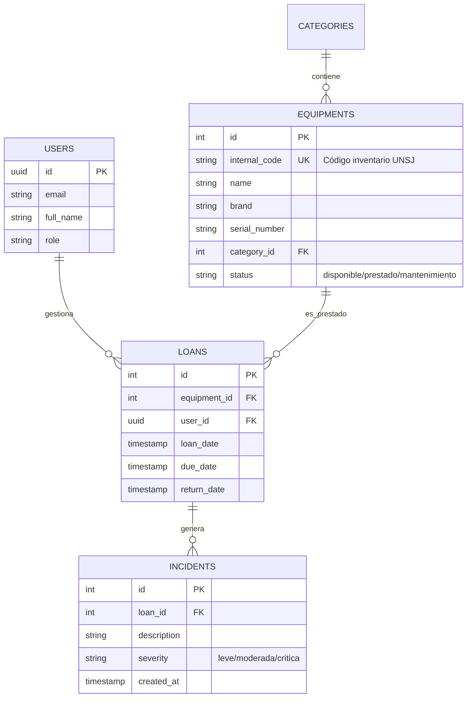

# Modelo de Datos - SmartStock

Este documento detalla la estructura de la base de datos relacional (PostgreSQL) para el control de activos del laboratorio de Geología (FCEFN-UNSJ).

## 1. Diagrama Entidad-Relación (MER)
Utilizamos la sintaxis Mermaid para representar las relaciones.

## 2. Diccionario de Datos
Tabla	Campo	Tipo	Descripción
EQUIPMENTS	internal_code	VARCHAR	Código físico pegado al equipo (ej: GEO-001).
EQUIPMENTS	status	ENUM	Controla si el equipo puede ser prestado o no.
LOANS	due_date	TIMESTAMP	Fecha límite de devolución (Materia: Backend/Lógica).
INCIDENTS	severity	VARCHAR	Gravedad del daño reportado en la devolución.

## 3. Consideraciones de Ciberseguridad en Datos

Integridad Referencial: No se pueden borrar categorías que tengan equipos asociados (RESTRICT).

Privacidad: Los IDs de los usuarios son UUID (no incrementales) para evitar que alguien adivine cuántos usuarios hay.