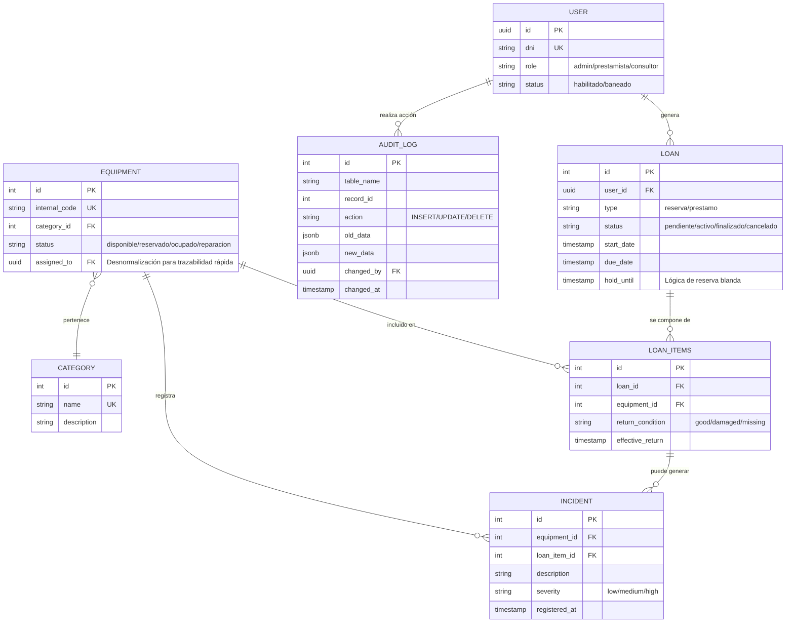

📊 Modelo de Datos - SmartStock
Este documento detalla la estructura de la base de datos relacional (PostgreSQL) diseñada para el control de activos de la cátedra de Geología de la FCEFN-UNSJ. El modelo está optimizado para garantizar la trazabilidad total, evitar el overbooking y permitir una gestión flexible de préstamos y reservas.

1. Diagrama Entidad-Relación (MER)
Utilizamos la sintaxis Mermaid para representar las relaciones lógicas y la cardinalidad entre las entidades del sistema.

2. Optimizaciones y Decisiones de Diseño (DBA Notes)
Para garantizar la integridad y el rendimiento del sistema bajo estándares profesionales, se han tomado las siguientes decisiones técnicas:

A. Auditoría Avanzada con JSONB
En la entidad AUDIT_LOG, se utiliza el tipo de dato jsonb de PostgreSQL. Esto permite capturar el estado completo del objeto (old_data y new_data) antes y después de cada transacción.

Beneficio: Facilita el "Time Travel" (reconstrucción de historial) y cumple con requerimientos de ciberseguridad al asegurar que ninguna acción sea anónima o irreversible.
B. Trazabilidad de Daños e Incidencias
Al conectar la tabla INCIDENT tanto con el equipo (EQUIPMENT) como con el ítem del préstamo (LOAN_ITEMS), el sistema puede identificar no solo qué equipo se dañó, sino exactamente bajo qué préstamo y qué responsable ocurrió el evento.

C. Desnormalización Estratégica
Se incorporó el campo assigned_to directamente en la tabla EQUIPMENT. Aunque esta información es derivable de los préstamos activos, tenerla de forma directa optimiza el rendimiento de las consultas en el Dashboard, permitiendo saber "Quién tiene este equipo" sin realizar Joins costosos.

3. Rendimiento e Indexación
Para asegurar búsquedas instantáneas incluso con un inventario extenso, se deben implementar los siguientes índices en PostgreSQL:

idx_equipment_status: Optimiza el filtrado de equipos libres para nuevos préstamos.
idx_loan_active: Acelera la detección de equipos en mora mediante la consulta: WHERE status = 'activo' AND due_date < NOW().
idx_user_dni: Garantiza la búsqueda instantánea de prestatarios durante el proceso de retiro.
4. Lógica de "Reserva Blanda" (Soft Reservation)
El sistema incorpora el campo hold_until en la tabla LOAN para gestionar la prioridad de stock:

Activación: Al realizar una reserva, el equipo pasa a estado reservado.
Caducidad: Si el usuario no se presenta a retirar el equipo antes de la fecha/hora estipulada en hold_until, un trigger de base de datos (o proceso programado) libera el equipo automáticamente cambiándolo a disponible.
Propósito: Evitar el bloqueo indefinido de activos críticos por reservas no reclamadas.
Este modelo asegura que SmartStock sea una plataforma escalable, auditable y técnicamente robusta, alineada a las exigencias académicas y operativas de la FCEFN-UNSJ.