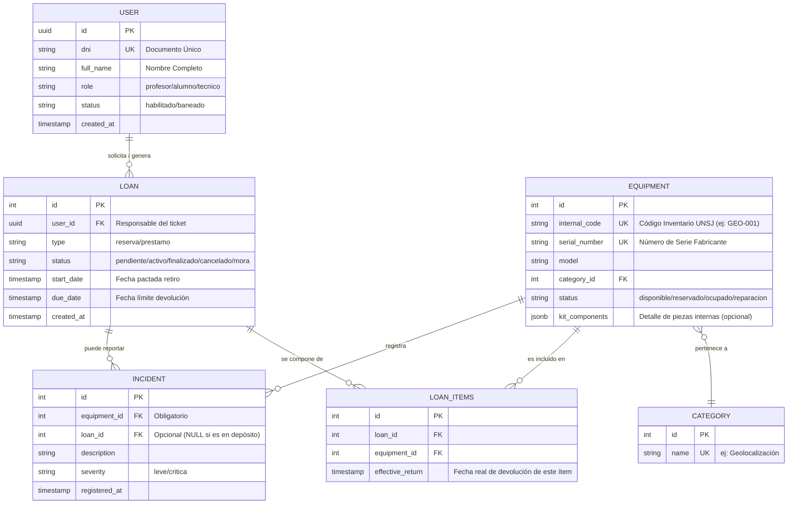

# Archivo: `docs/modelo_datos.md`

# Modelo de Datos - SmartStock

Este documento detalla la estructura de la base de datos relacional (**PostgreSQL**) diseñada para el control de activos de la cátedra de Geología de la **FCEFN-UNSJ**. El modelo está optimizado para garantizar la trazabilidad, evitar el *overbooking* y permitir una gestión flexible de préstamos y reservas.

---

## 1. Diagrama Entidad-Relación (MER)

Utilizamos la sintaxis Mermaid para representar las relaciones lógicas entre las entidades.

---

## 2. Decisiones de Diseño y Normalización

### A. La Relación Muchos a Muchos (`LOAN_ITEMS`)
Un préstamo puede incluir varios equipos simultáneamente. En lugar de limitar el `equipment_id` dentro de la tabla de cabecera (`LOAN`), utilizamos una tabla asociativa. 
- **Ventaja**: Permite devoluciones parciales. Un usuario puede devolver un GPS pero retener un martillo de geólogo un día extra, cerrando solo la línea correspondiente en `effective_return`.

### B. Gestión de Kits mediante `JSONB`
Para equipos complejos que contienen piezas pequeñas (lupas, balanzas, cables), se utiliza el tipo de dato **JSONB** de PostgreSQL en el campo `kit_components`.
- **Estrategia**: No se crean tablas para componentes menores (tornillos, fundas), pero se deja asentado el inventario interno para que el administrativo lo verifique manualmente al recibir el kit.

### C. Trazabilidad y Auditoría
- **Ubicación**: Cada cambio en `current_location` en la tabla `EQUIPMENT` dispara un *Trigger* de base de datos que guarda el histórico en una tabla de auditoría (`Logs`).
- **Seguridad**: Se utilizan **UUID** (identificadores universales únicos) para los usuarios. Esto previene que agentes externos deduzcan el volumen de usuarios mediante ataques de enumeración.
- **Integridad**: Se aplica una restricción de **RESTRICT** en las categorías; no es posible borrar una categoría si contiene equipos asociados.

---

## 3. Lógica Funcional del Modelo

### Paso 1: Unificación de Movimientos (`LOANS`)
En lugar de fragmentar el modelo en tablas de "Reservas" y "Préstamos", se utiliza una sola entidad con dos atributos clave:
- **Atributo `type`**: Define si el registro es una "reserva" (promesa futura) o un "prestamo" (equipo entregado).
- **Atributo `status`**: Gestiona el ciclo de vida (pendiente, activo, finalizado, cancelado, mora).

### Paso 2: Control de Estados y "Overbooking"
El estado físico del equipo en `EQUIPMENT` es dependiente de las transacciones:
- Si el equipo está en un préstamo activo, su estado es `ocupado`.
- Si está en una reserva pendiente, su estado es `reservado`.
- **Regla de Negocio**: El sistema impide la creación de un `LOAN_ITEM` si el equipo no posee el estado `disponible`.

### Paso 3: Historial de Incidencias (`INCIDENTS`)
La incidencia se ligan directamente al `equipment_id`. 
- Si un equipo vuelve dañado, se registra la incidencia vinculándola al préstamo responsable (`loan_id`). Esto mantiene la integridad del historial del activo según normas **ISO 55000**, independientemente de quién sea el usuario actual.

---

## 4. Flujo de Persistencia (Ejemplo Típico)

1.  **Reserva**: Se crea un registro en `LOANS` (`type: reserva`, `status: pendiente`). Los equipos asociados en `LOAN_ITEMS` cambian su estado en `EQUIPMENT` a `reservado`.
2.  **Retiro (Conversión)**: El gestor actualiza el registro. El `type` cambia a `prestamo` y el `status` a `activo`. Los equipos en `EQUIPMENT` pasan a `ocupado`.
3.  **No-Show (Expiración)**: Un proceso automático busca reservas pendientes cuya `start_date` haya pasado. El sistema cambia el `LOANS` a `cancelado` y libera automáticamente los equipos a `disponible`.

---
*Este modelo asegura que SmartStock sea escalable, auditado y técnicamente robusto para las exigencias de la FCEFN-UNSJ.*